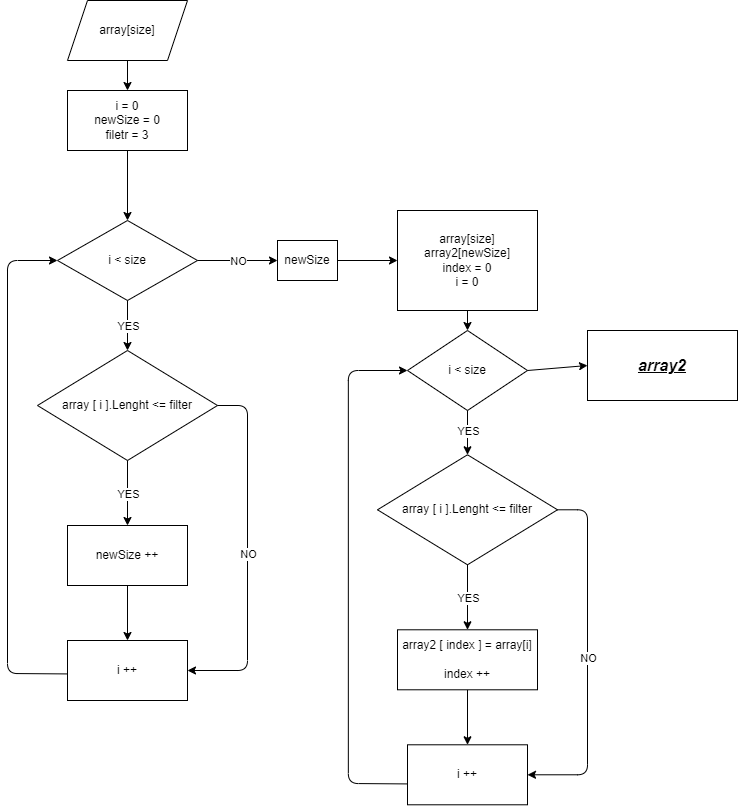

# Итоговая проверочная работа по курсу **"Знакомство с языками программирования"**

## **Что необходимо:**
* Создать репозитори на GitHub
* Нарисовать блок схему алгоритма
* Снабдить репозиторий офрмленным текстовым описанием решения
* Написать программу, решающую поставленную задачу
* Использовать контроль версии в работе над этим не большим проектом.
---

https://github.com/Denish108

---

